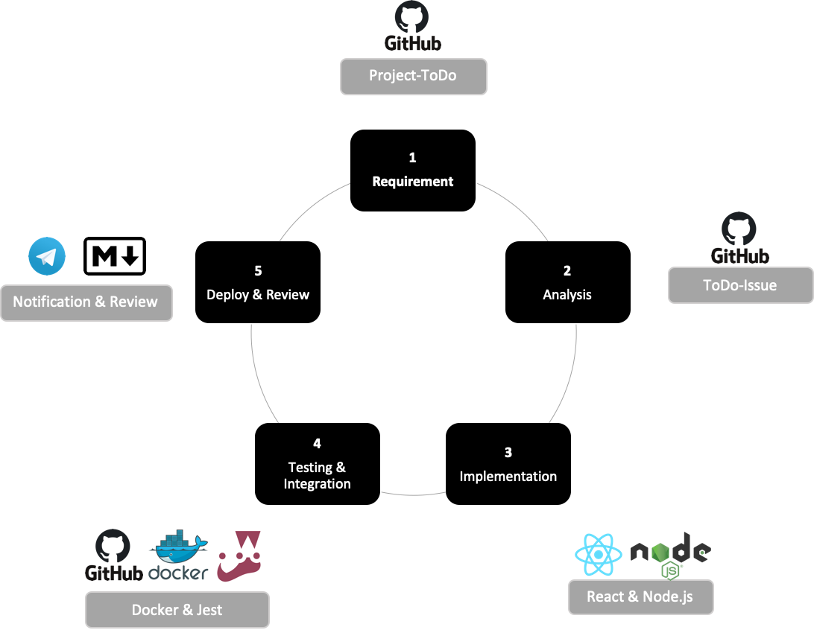
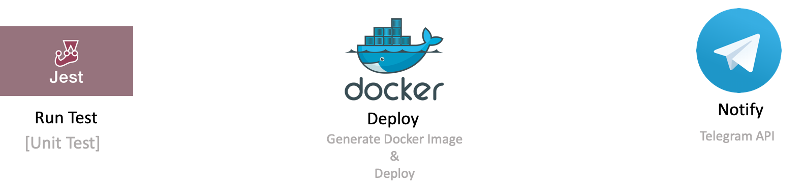

# Agile Process

> Writer: 전상규
>
> Date: 2020-05-19
>
> * Contents
>   * Agile Development Cycle
>   * Documentation Policy
>   * Test tool
>   * Notification

## Agile Developemnt Cycle

### 1. Requirement

* Githun Project 정리
* 추가되거나 삭제되어야 할 To-do list 혹은 작업이 끝난 issue close한다.

### 2. Analysis

* To-Do list로 부터 작업하게 될 task를 issue로 등록한다.
* To-Do에 등록이 되어 있지 않은 task인 경우, issue를 생성한 뒤, 올바른 project에 추가한다.

### 3. Implementation

* 등록한 issue에 맞춰서 개발을 한다.

### 4. Testing & Integration

* 작업한 code를 Jest에서 test를 돌려본다.
* 문제가 없다면 Github에 commit & push를 한다.
* 문제 없이 commit & push가 되면 자동으로 docke imager를 생성하여, server에 image를 보낸다.

### 5. Deploy & Review

* Push와의 동시에 Telegram Bot으로 가장 최근 commit message와 server domain을 보내준다.
* 눈으로 확인이 되었다면, 작업한 issue에 대하여 close를 한다.
* 작업을 진행한 task에 대하여 간단한 tech review를 작성하여 team원들에게 공유한다.

## Method

### Overview

### Details

## Test Tool

[Testing Tool](https://blog.logrocket.com/the-best-unit-testing-frameworks-for-node-js/)

### :star:[Jest](https://jestjs.io/) 

> * Jest is a delight JavaScript Testing Framework, with a focus on simplicity.
>
> * It works with projects using: Babel, Typescript, Node, Angular, Vue and more

* Pros
  * Well docuemnted
  * Easy set up
  * Parallel test runninng
  * fast
  * it includes features like snapshots, coverage and test watching
* Cons
  * Same error with multiple erros message
  * Requires more dependencies during initial setup.

### [Jasmine](https://jasmine.github.io/)

* Pros
  * Simple setup
  * A lot of tutorial
  * Behavior-driven development focused.
  * Many plugins for CI servers.
* Cons
  * Unfriendly error logs.
  * Ansynchronous testing can be quire hustle.
  * Assertion library is not as rich as Chai

## Notification

### Telegram API Botcc

### Github Push

* webhook
* hook
* Github Action

