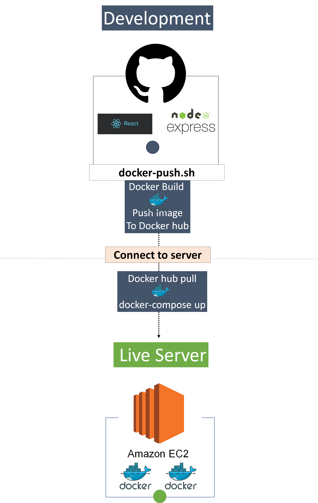
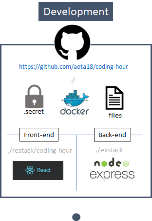
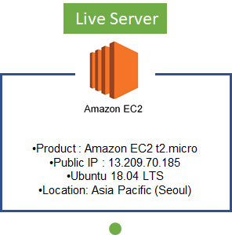
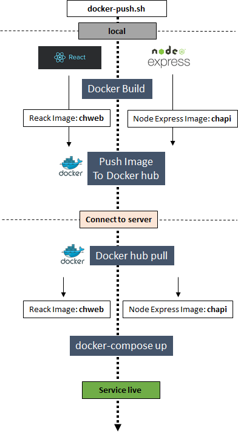

# Coding Hour Environment Documentation

> Writer: 전상규
>
> Date: 2020-05-13
>
> Reference: [Deveopment Environment Setting by 서상원](https://docs.google.com/document/d/1kKlKCd2y7YkGWIlcU7otdQ_fi91Ce_-m8s12oNY-Zn4/edit)
>
> * Contents
>   * Development Environment
>   * Server Environment
>   * Deploy

<center>
  
</center>

## Development Environment


<center>
  
</center>

### Front-end: React

* front-end source code는  전부 ``./rastack/coding-hour``에 존재한다.

* local에서 돌리기 위해서는 npm install 필요

  ```bash
  npm install
  ```

### Back-end: Node.js Express

* back-end source code는  전부 ``./exstack``에 존재한다.

* local에서 돌리기 위해서는 npm install 필요

  ```bash
  npm install
  ```

### Files

* docker-compose.yml
  *  ?
* docker-push.sh
  * docker-push.sh는 다음과 같은 일을 수행한다.
    * back-end와 front-end를 빌드하여 docker image를 생성한다.
    * server에 접속한다.
    * server에서 docker hub을 통해 pull을 받는다.
    * pull 받은 docker image를 활성화한다.
* RAEDME.md
  * project 설명 md 파일

### .secret

* 13.209.70.185 server에 접속하기 위한 keypair의 값을 ``pem``  확장자로 갖고 있는 폴더

* 서버에 접속하기 위해서는 최상위 폴더에서 다음 commnad를 통해서 접속 가능하다.

  ```
  ssh -i ./.secret/amzSeoul.pem ubuntu@13.209.70.185
  ```

  

## Live Server


<center></center>

* live server는 [Amazon EC2](https://docs.aws.amazon.com/ko_kr/AWSEC2/latest/UserGuide/concepts.html)(Amazon Elastic Compute Cloud)를 활용한다. 
* Amazon EC2는 확장식 컴퓨팅을 제공한다.
  * 가상 컴퓨팅 환경
* DB는 Mongo DB를 사용하며, local과 server 쪽 모두 연결이 되어 있다.

## Deploy

> * ``docker-push.sh`` 을 기반으로 deploy가 되는 workflow

<center></center>

* Docker Build
  * react와 node.js를 docker로 통해 image를 생성한다.
  * "chweb"과 "chapi"는 ``docker-push.sh``에 정의 된 변수이다. 
* Push Image to Docker Hub
  * 생성된 image는 정의된 docekr_account의 docker-hub에 push한다.
* Connect to Server
  * ``ssh``를 통해서 server에 접속한다
* docker-hub pull
  * docker에 push 된 image를 pull 한다
* docker-compose up
  * pull 받은 image를 활성화 한다. 
