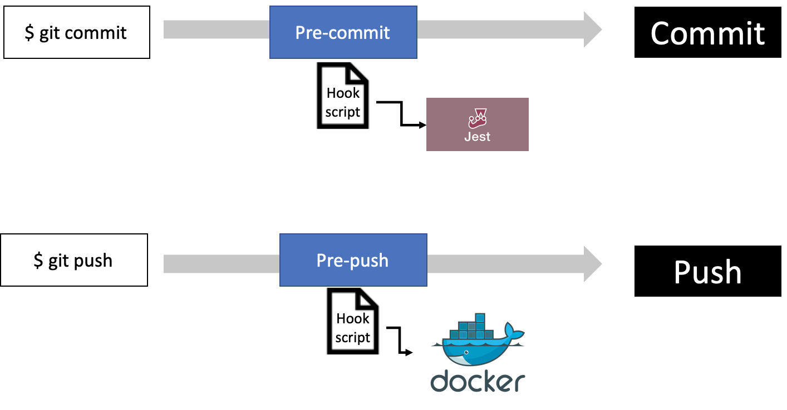
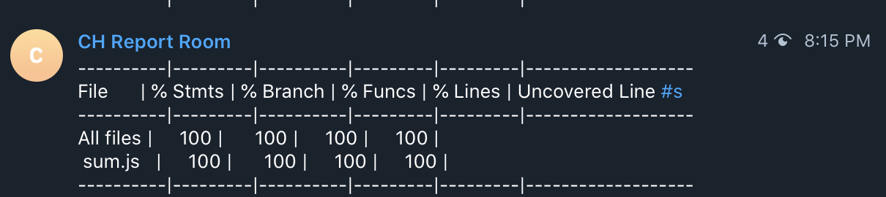
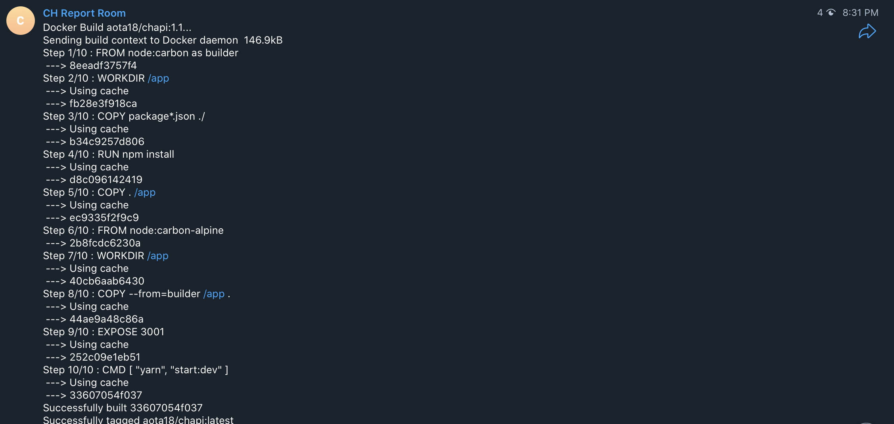

# Using Hooks to test and build 

> Writer: 전상규
>
> Date: 2020-05-27
>
> * Contents
>   * Hooks
>   * Telegram
>   * Pre-Commit
>   * Pre-Push


* 이번 docs에서는 git에서 제공하는 hooks를 통해서 test와 build를 commit과 push에 trigger되는 과정을 설명한다.
* 위 그림과 같이 commit에서는 Jest를 통해서 unit test를 실행하며, push를 할 경우 docker를 통해서 server로 docker image가 전달되는 process이다.

## [Hooks]([https://git-scm.com/book/ko/v2/Git%EB%A7%9E%EC%B6%A4-Git-Hooks](https://git-scm.com/book/ko/v2/Git맞춤-Git-Hooks))

> hooks는 어떤 이벤트가 생겼을 때 자동으로 특정 스크립트를 실행하도록 할 수 있다. 



* ``$ git commit``  혹은 ``$ git push`` 의 cmd를 통해서 jest혹은 docker를 자동으로 실행하기 위해서는 hooks를 사용하면된다.
* hooks는 새로운 repository를 생성했을 때, ``./.git/hooks``에 존재하는 파일이다. 주위해야할 점이 2가지가 있다.
  1. ``./git``은 commit이 되지 않는다. 즉 repository에서 독립적으로 관리된다.
  2. git init을 통해서만 hooks folder가 .git에 생성이 된다. (없는 경우 수동으로 생성하면된다)
* hooks file들은 git으로 부터 독립적으로 관리가 되어야 한다. Team 단위로 진행을 할 경우(현장에서는 자동 빌드 tool을 사용하거나 web hooks를 사용한다고 애기를 들었다) 개개인이 hooks 파일을 직접 설정해야한다.
* 우리가 사용하게 될 hooks의 file인 ``pre-commits``와 ``pre-push`` 아래에 제지된 곳에 설정해주면 된다.
  * ``pre-commits.sample``과 ``pre-push.sample``은 hooks를 작성하는 방법을 설명하는 글이기에 작동하는 데는 필요가 없다.

```
.git
└──hooks
	 ├── pre-commits.sample
	 ├── pre-push.sample
	 ├── ....
	 ├── ....
   ├── pre-commits
   └── pre-push
```

## [Telegram](https://core.telegram.org/bots/api)

> Hooks에 대해서 자세히 설명하기 이전에 telegram에 대해서 설명을 간단히 설명한다. 


* 지속적으로 commit message와 push message에 대하여 forwarding 해주는 public channel은 아래와 같다.
  * https://t.me/CHReportRoom
* Telegram에서는 간편한 bot API를 제공한다. Botfather의 API를 활용해서 hooks file에 연결하면, commit과 push에 대해서 간편하게 팀원들과 commit 내용과 build에 관한 정보를 자동으로 공유할 수 있다.
* Telegram Bot이 참여한 channel을 팀원들과 공유하기 위해서는 public channel에서 adminstarter를 bot으로 임명하고 팀원들을 초대해서 사용해야한다. (아마도 private channel에는 channel id를 얻을 수 없어서 인 듯하다)
* telegram bot을 생성하는 방법은 아래 링크를 참고하자
  * [코스모스팜 블로그]([https://blog.cosmosfarm.com/archives/1070/%ED%85%94%EB%A0%88%EA%B7%B8%EB%9E%A8-%EB%B4%87-telegram-bot-%EB%A7%8C%EB%93%A4%EA%B8%B0/](https://blog.cosmosfarm.com/archives/1070/텔레그램-봇-telegram-bot-만들기/))

* ``sendMessage`` API를 활용해서 channel_ID와 bot의 일련번호를 통해서 bot을 활용하면 된다.
  * Example: ``` https://api.telegram.org/bot123456:ABC-DEF1234ghIkl-zyx57W2v1u123ew11/getMe```

## Pre-Commit

> :lock: 보안을 위해서 BOT_TOKEN과 CHAT_ID는 포함시키지 않았다.:lock:
>
> * 이제 ``pre-commit``의 내용에 대해서 보자

```sh
#!/bin/sh


#You can get yout chat id by interacting with telegram channel called "GetID Bot"
CHAT_ID='-100*'

#BOT_TOKEN number is shown when you generated your bot in BotFather channel
BOT_TOKEN=''

#This is URL format of Telegram API
URL="https://api.telegram.org/bot$BOT_TOKEN/sendMessage"

LAST_COMMIT=$(./node_modules/.bin/jest --coverage | cat)

curl -s -X POST $URL -d chat_id=$CHAT_ID -d text="$LAST_COMMIT"
```

* ``CHAT_ID``: public channel id를 의미한다. public channel의 실제 id는 -100의 prefix를 제외한 번호이다.
  * public channel의 Id를 확인하기 위해서는, telegram을 web으로 접속해서 url을 확인하면 마지막에 있는 번호의 일부분인 것을 알 수 있다.
* ``BOT_TOKEN``: bot의 번호이다. 이 token을 갖고 있는 bot이 ``CHAT_ID``에서 정의 된 channel에 message를 보내는 것이다.
* ``URL``: ``URL`` 형식을 통해서 API를 활용한다.
  * sendMessage는 Telegram에서 제공하는 API이다.
* ``LAST_COMMIT``: commit을 통해서 전달될 내용을 담는다.
  * 현재는 ``jest``를 통해서 test를 실행하기에, ``jest``를 실행하는 코드가 담겨있다.
* ``curl``: 마지막으로 ``curl``을 통해서 API를 호출한다.

* :warning: 주의 할 점
  * ``jest``를 실행하기 위해서는 local 환경에 jest가 설치가 되어 있어야 한다.

## Pre-push

> :lock: 보안을 위해서 BOT_TOKEN과 CHAT_ID는 포함시키지 않았다.:lock:
>
> * Pre-push 또한 pre-commit과 동일한 API를 사용한다. 다만, 담기될  명령어 다르다. 고로 API에 대한 설명은 생략하겠다.

```sh
#!/bin/sh


CHAT_ID='-100*'

#BOT_TOKEN number is shown when you generated your bot in BotFather channel
BOT_TOKEN=''

#This is URL format of Telegram API
URL="https://api.telegram.org/bot$BOT_TOKEN/sendMessage"

EXE_DOCKER=$(./docker-push.sh)

curl -s -X POST $URL -d chat_id=$CHAT_ID -d text="$EXE_DOCKER"
```

* ``pre-push``에서는 미리 작성되어 있는 ``docker-push.sh``를 실행한다.
* :warning: ​여기서 주의할 점은 이 script에서 실행되는 cmd는 repository의 최상위 path를 기준으로 실행이 된다.
  * ``.git/hooks``가 아닌 ``./``을 기준으로 실행이 되는 것이다.
  * ``docker-push.sh``를 처음 실행하는 경우, 수동으로 한번 server에 접속해야한다. 그렇지 않은 경우, server에 대한 key 값을 등록하는 절차에서 무한대기를 할 것이다. 고로 수동으로 한번 접속해서 key 값을 받은 후 해당 script를 작동해야한다.

## Conclusion

* 위에서 설명한 방법으로``.git/hooks``에 ``pre-commit``과 ``pre-push`` 파일을 작성하고, telegram에서 해당 channel에 접속을 한다면 이후 부터는, commit과 push에 대하여 test와 build에 대한 정보를 볼 수 있다.

* https://t.me/CHReportRoom에 접속해야함 message확인이 가능하다.

* Example

  | pre-commit message                                           | pre-push message                                             |
  | ------------------------------------------------------------ | ------------------------------------------------------------ |
  |  |  |

  

